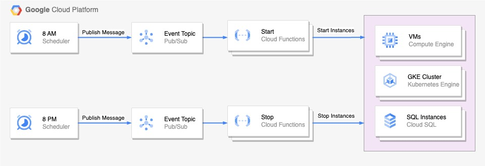

# Functions to Start and Stop Google Cloud Resources

Cloud Schedulers and Cloud Functions to automatically start and stop Compute Engine instance, SQL instance and Google Kubernetes Engine node pool on a regular schedule. This can be used in non-production environment that you need to stop on a nightly basis and restart them in the morning to save costs.

## Architecture



This includes the following Google Components:

- `Cloud scheduler` to make calls on a set schedule to start and stop the instance.
- `Pubsub topics` to send message for each start and stop event.
- `Cloud functions` to start and stop the instances we want to schedule.
- `Cloud SQL`, `GKE cluster`, `Compute Engine instance` we want to run on a schedule.

## Usage

There is a Terraform module that you can use to provision Cloud scheduler, Pubsub topics and cloud functions. Example can be seen in [`terraform/examples`](./terraform/examples/) directory.

```
module "start_stop_scheduler" {
  source             = "github.com/oun/gcp-instances-scheduler.git//terraform"
  project_id         = "scheduler-project-id"
  region             = "asia-southeast1"
  time_zone          = "Asia/Bangkok"

  schedules = [
    {
      start_job_name = "start-instances"
      stop_job_name  = "stop-instances"
      start_schedule = "0 8 * * 1-5"
      stop_schedule  = "0 20 * * 1-5"
      project        = "resource-project-id"
    }
  ]
  
  gce_function_config = {
    enabled = true
  }
  sql_function_config = {
    enabled = true
  }
  gke_function_config = {
    enabled = true
  }
}
```

## Versioning

We use SemVer for versioning. For the versions available, see the [tags](https://github.com/oun/gcp-instances-scheduler/tags) on this repository.

## Authors

- Worawat - Initial work

## License

This project is licensed under the Apache-2.0 License - see the [LICENSE](./LICENSE) file for details.
